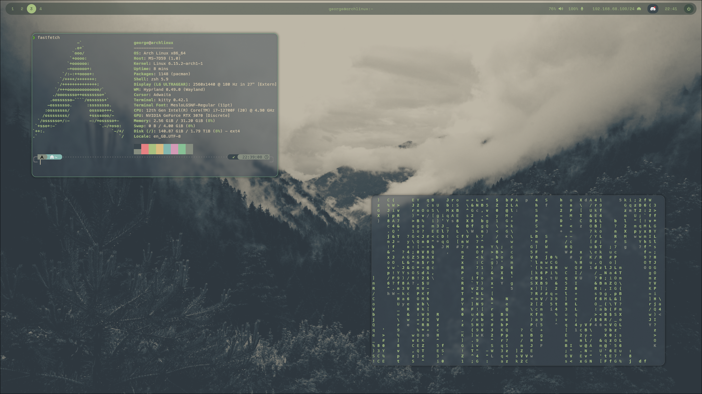
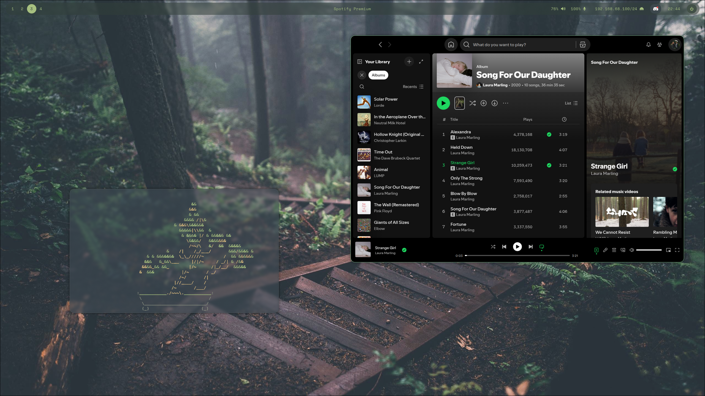

# HyprForest
## My Arch based Hyprland Config with an Everforest theme (WIP)

### Wallpapers
I have expanded the wallpaper directory with some of my own photos edited to match the everforest theme. Feel free to use these images in your own dotfiles. If you are sharing these images some credit would be much appreciated :).

#### Wallpaper Creationg
When creating the wallpapers I followed the following steps to make them match the theme:

- Create new layer
    - Fill layer with either:
        - Solid fill of: 949494
        - Gradient to alpaha of 949494 (Only use on images with a greater depth between the foreground and background)
        - Set opacity to 7% for monochrome images (or 10% for coloured images)
- Apply Gaussian blur with a radius of 1.5px to base image
